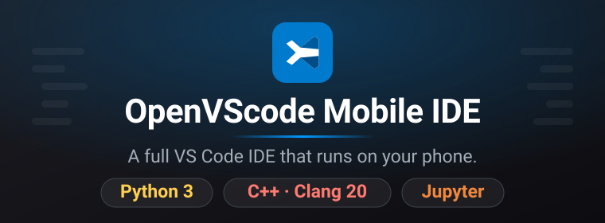

<p align="center">
  
</p>

<p align="center">
  <a href="https://github.com/hammadshakeelai/OpenVScode/releases/latest/download/OpenVScode-Mobile-apk.zip">
    
  </a>
</p>

<p align="center">
  <a href="https://github.com/hammadshakeelai/OpenVScode/actions/workflows/android.yml"></a>
  <a href="https://github.com/hammadshakeelai/OpenVScode/releases/latest"></a>
  
  
  
  
  
</p>

---

## 📲 Install the APK (straight from your phone)

> [!IMPORTANT]
> **The APK is the shell; Termux is the engine.** The app carries the installer and
> runs it for you. You install Termux once, tap through four steps, and the app
> installs code-server, Python and a C++ compiler inside Termux and opens the editor
> on `127.0.0.1:8080`. You can also point the app at a code-server you already run
> somewhere else.
>
> **Termux must be the F-Droid or GitHub build.** The Google Play build ships without
> the `RUN_COMMAND` service, so no app can drive it. The setup screen detects that
> build and says so instead of failing later.

**On the phone, tap this link:**

### → [**Download OpenVScode-Mobile-apk.zip**](https://github.com/hammadshakeelai/OpenVScode/releases/latest/download/OpenVScode-Mobile-apk.zip) ←

That link always resolves to the newest build, so it never goes stale. Then:

1. Open **Files → Downloads** and tap the zip to extract it.
2. Tap `OpenVScode-Mobile.apk` inside.
3. Android will ask to allow installs from this source — tap **Settings**, turn on
   **Allow from this source**, go back, and tap **Install**.
4. Launch **OpenVScode** from your app drawer.

> [!TIP]
> **Why a zip and not the APK directly?** Chrome on Android routes `.apk` downloads
> through an APK-specific Safe Browsing check and holds the file until a verdict comes
> back. A debug-signed build from a small repo has no download reputation, so that
> verdict never resolves and the download **hangs at ~100% with no error** — the bytes
> have all arrived, Chrome just will not release the file. GitHub serves `.zip` as
> `application/octet-stream`, which skips that path. Same bytes either way; the
> checksums on each release prove it.

<details>
<summary><b>Other ways to get the APK</b></summary>

- **Direct APK:** [OpenVScode-Mobile.apk](https://github.com/hammadshakeelai/OpenVScode/releases/latest/download/OpenVScode-Mobile.apk)
  — identical build. Fine in Firefox, Samsung Internet, or on a desktop; this is the
  one that stalls in Chrome for Android.
- **Verify what you downloaded:** each release ships `SHA256SUMS.txt` covering both
  files. CI also fails the build if the zip does not extract to a byte-identical APK.
- **Browse every version:** the [Releases page](https://github.com/hammadshakeelai/OpenVScode/releases)
  lists each build with its notes.
- **Bleeding edge:** every push to `master` uploads both files to its
  [Actions run](https://github.com/hammadshakeelai/OpenVScode/actions/workflows/android.yml)
  as build artifacts. GitHub requires you to be signed in to download those, so the
  release link above is the one that works with a single tap on a phone.
- **Build it yourself:** `cd android && ./gradlew assembleDebug` — the APK lands in
  `android/app/build/outputs/apk/debug/`.

</details>

> [!NOTE]
> These are **debug** builds, signed with the standard Android debug key. That is what
> makes them installable without a Play Store account. Because `app/build.gradle` sets
> `applicationIdSuffix = ".debug"`, the package id is `com.openvscode.mobile.debug`, so
> it installs *alongside* a release build rather than replacing one.

### What the app does

The APK is a native Android shell around the IDE. It runs a **foreground service**
holding a wake lock, so Android will not kill your compiler mid-build; it renders the
editor in a hardware-accelerated **WebView**; and it overlays a **touch coding keybar**
(`ESC`, `TAB`, `CTRL`, `ALT`, `{ }`, `( )`, arrows) that a phone keyboard does not give you.

It expects the IDE server described below to be reachable on `127.0.0.1:8080`.

---

## ⚡ The same setup, by hand

> [!NOTE]
> **You do not need any of this if you use the app** — it stages these same scripts
> inside Termux and runs them for you, showing live progress. This section is the
> manual path: useful for a headless phone, for scripting, or for reading exactly
> what the app is about to do. Every step is idempotent, so a failed run can simply
> be repeated. Please [report what breaks](https://github.com/hammadshakeelai/OpenVScode/issues).

### Step 1 — Install Termux

Get **Termux** from [F-Droid](https://f-droid.org/en/packages/com.termux/) or the
[GitHub releases](https://github.com/termux/termux-app/releases). The Google Play
build is a separate, restricted app: it has no `RUN_COMMAND` service, so the OpenVScode
app cannot drive it.

### Step 2 — Paste one line

Open Termux and paste this. It is the only command you need:

```bash
pkg install -y curl && curl -fsSL https://raw.githubusercontent.com/hammadshakeelai/OpenVScode/master/install.sh | bash
```

It installs `curl`, downloads the installer, and runs it. The installer then
does this, announcing each step as it goes:

| Step | What it does |
|---|---|
| **Checks Termux and your CPU** | Stops immediately with a clear message if you are not in Termux, instead of failing halfway through. |
| **Asks for storage access** | One Android prompt. Tap Allow so the IDE can open your Downloads and Documents. Skipped if already granted. |
| **Downloads the scripts** | Installs `git`, clones this repository to `~/OpenVScode`. Updates it instead if it is already there. |
| **Installs the toolchain** | Python 3, C/C++ (Clang), Node, code-server and the Jupyter kernels. **This takes 10–30 minutes** depending on your phone — keep the screen on. |
| **Starts the IDE** | On `127.0.0.1:8080`, and waits until it genuinely answers before saying it worked. |

Everything is written to `~/openvscode-install.log`.

> [!TIP]
> **If it stops partway, paste the same line again.** Every step checks whether
> it is already done, so re-running resumes rather than starting over.

### Step 3 — Open it

Either open the **OpenVScode** app — it finds `127.0.0.1:8080` on its own — or
visit `http://127.0.0.1:8080` in Chrome.

To start the IDE again on a later day:

```bash
cd ~/OpenVScode && ./start.sh
```

> [!TIP]
> **No APK needed for a fullscreen app:** in Chrome/Edge/Brave, tap ⋮ →
> **Add to Home screen** / **Install app**. It launches borderless, with no address
> bar, just like a native app.

---

## 🚀 Features & Built-in Capabilities

### 1. 🐍 Python Environment
- **Python 3 + Pip**: Full package management.
- **`ipykernel`**: Seamless integration with Jupyter.
- **Language Server**: Autocomplete, type hinting, and auto-imports.
- **1-Click Execution**: Dedicated Run button for Python scripts.

### 2. ⚡ C / C++ Environment
- **Modern C++20 compiler**: `g++`, `gcc`, `make`, `cmake`.
- **Why GCC and not Clang:** in the downloadable IDE image, Clang costs about
  198 MB — `libLLVM` alone is 98 MB — out of a 1.2 GB filesystem, and `g++`
  compiles the same C++20 for a small fraction of that. On a phone, where the
  image has to be downloaded before anything works, that trade is worth making.
  The Termux path still installs Clang, since there the toolchain is fetched
  on-device rather than shipped.
- **Verified in CI**: every published image compiles a real C++20 program before
  it is allowed to ship.

### 3. 📓 Jupyter Notebooks (Dual-Kernel: Python & C++)
- **Native Notebook UI**: Interactive cells directly inside VS Code (`ms-toolsai.jupyter`).
- **Python Kernel**: Standard `ipykernel`.
- **C++ kernel (`jupyter-cpp-kernel`)**: installed via `pip`; compiles and runs
  C++ cells on the fly. The published image registers kernels for C++98 through
  C++23.

### 4. 📱 Mobile-First Ergonomics
- **No Wasted Screen Space**: Minimap and glyph margins disabled; word-wrap enabled.
- **Background Protection**: Auto-save enabled on delay (`files.autoSave: "afterDelay"`) so no edits are lost if Android suspends the app.
- **Touch Coding Keybar**: Included `mobile-keyboard-bar.js` and Termux extra keys configuration providing `ESC`, `TAB`, `CTRL`, `ALT`, `{ }`, `( )`, and arrow keys.

---

## 📂 Repository Structure

```
OpenVScode/
├── setup.sh                         # 1-click bootstrap installer (Termux)
├── start.sh                         # Launcher with wake-lock, waits for the port
├── config/
│   ├── settings.json                # Pre-tuned mobile VS Code settings
│   ├── keybindings.json             # Mobile touch shortcuts
│   └── compile_flags.txt            # Clangd include paths & C++20 standard
├── scripts/                         # Toolchain / kernel / extension installers
├── examples/
│   ├── hello_python/                # Sample Python project
│   ├── hello_cpp/                   # Sample C++ project with Makefile
│   └── notebooks/                   # Sample Python & C++ Jupyter notebooks
├── android/                         # Native Android app (Gradle project)
│   ├── app/src/main/java/…          # MainActivity (WebView) + VScodeService (foreground service)
│   ├── app/src/main/res/…           # Layouts, theme, launcher icon
│   ├── manifest.json                # PWA manifest for standalone browser mode
│   └── mobile-keyboard-bar.js       # On-screen touch coding keyboard bar
├── test-harness/                    # Browser simulator for the keybar: phone viewport,
│                                    # virtual-keyboard resize, key injection, test suite
├── tools/rootfs/                    # Dockerfile for the downloadable Linux image
├── .github/workflows/android.yml    # CI: builds the APK, attaches it to releases
├── .github/workflows/rootfs.yml     # CI: builds the rootfs image per architecture
└── docs/
    ├── assets/banner.svg            # README banner
    ├── SELF_BOOTSTRAP_PLAN.md       # Running a Linux rootfs on Android: measurements + plan
    ├── MOBILE_OPTIMIZATIONS.md      # RAM, battery, and Android 12+ process fixes
    └── JUPYTER_CPP_EXPLAINED.md     # In-depth guide on C++ Jupyter kernels
```

---

## 🛠️ Testing Your Installation

Once launched, navigate to `~/OpenVScode_Workspace` in the file explorer:
1. **Python**: Open `hello_python/main.py` and click the **Run** (Play) button.
2. **C++**: Open `hello_cpp/main.cpp` and click **Run**, or run `make run` in the built-in terminal.
3. **Jupyter Notebook**:
   - Open `notebooks/test_python.ipynb` and run the cells.
   - Open `notebooks/test_cpp.ipynb`, select the **C++ (Clang++)** kernel in the top-right corner, and run the C++ cells!

---

## 🔋 Recommended Android Tweaks

For maximum stability:
1. **Disable Battery Optimization**: Set Termux/OpenVScode to "Unrestricted" in Android App Settings.
2. **Android 12+ Phantom Process Killer**: If you experience sudden background kills during heavy compiling, disable phantom process limits (see [docs/MOBILE_OPTIMIZATIONS.md](docs/MOBILE_OPTIMIZATIONS.md)).
3. **Keyboard**: We recommend installing **Hacker's Keyboard** from F-Droid for a full 5-row desktop layout.

---

## 🧑‍💻 Building the Android app locally

Requires JDK 17 and the Android SDK (compileSdk 35).

```bash
cd android
./gradlew assembleDebug
```

`local.properties` is deliberately untracked — Android Studio writes your own `sdk.dir`
into it on first open, or you can set `ANDROID_HOME` in your environment instead.

Every push to `master` runs the same build in CI, and pushing a `v*` tag publishes the
resulting APK to a GitHub Release.

---

## 📄 License
MIT License. Built using open-source tools: VS Code / Code-Server, LLVM/Clang, Project Jupyter, and Open VSX.
