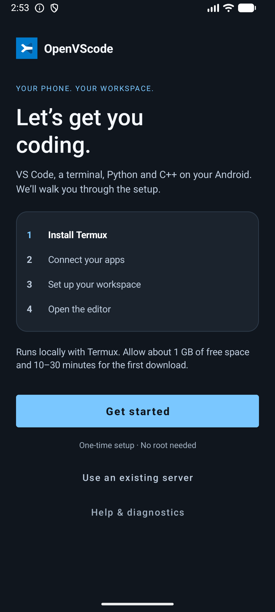
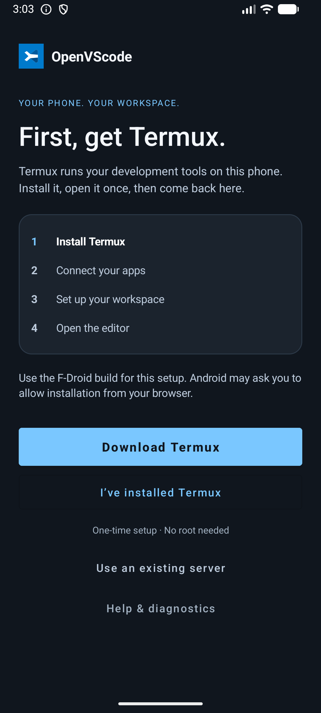
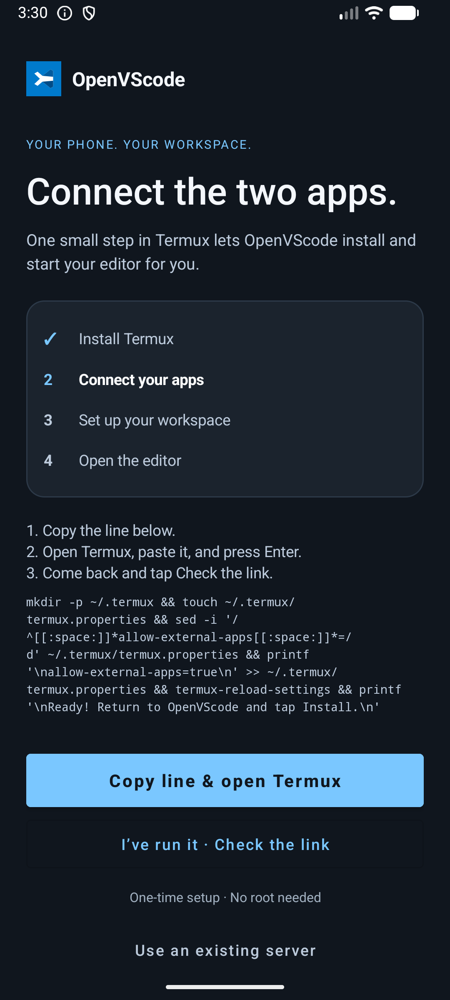
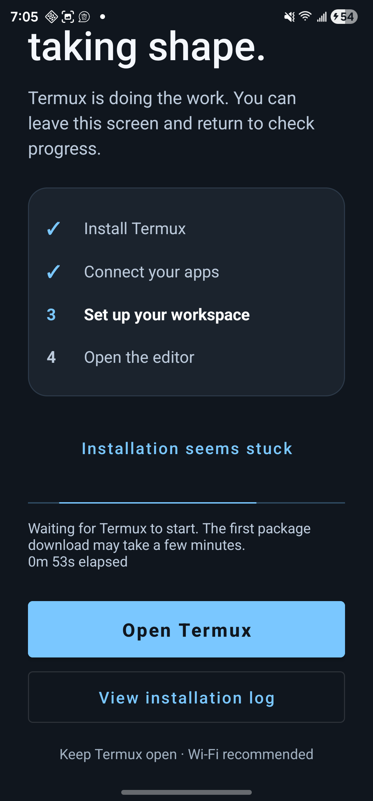
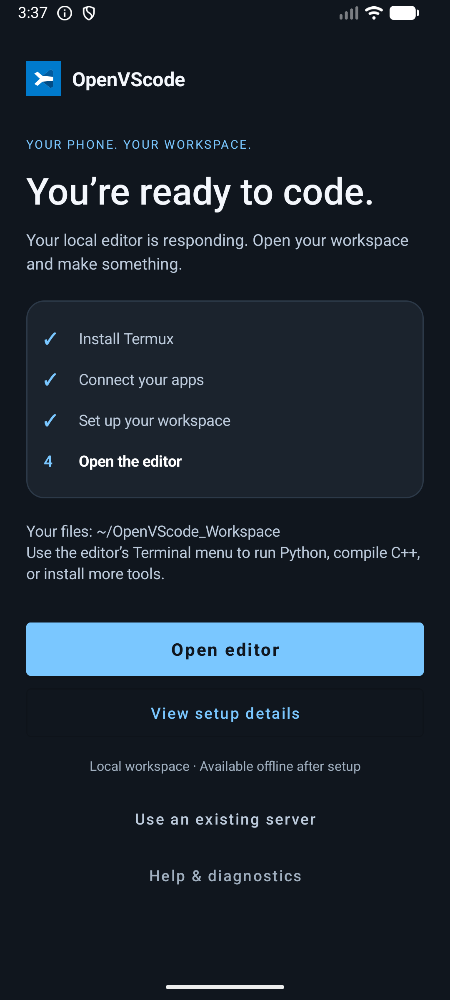
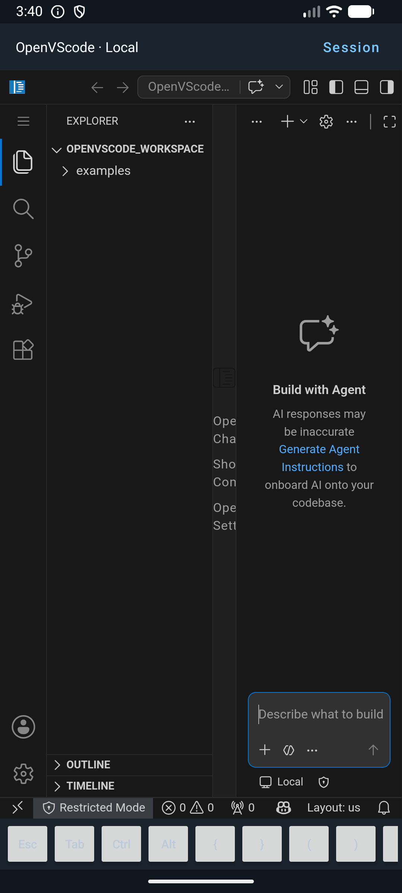
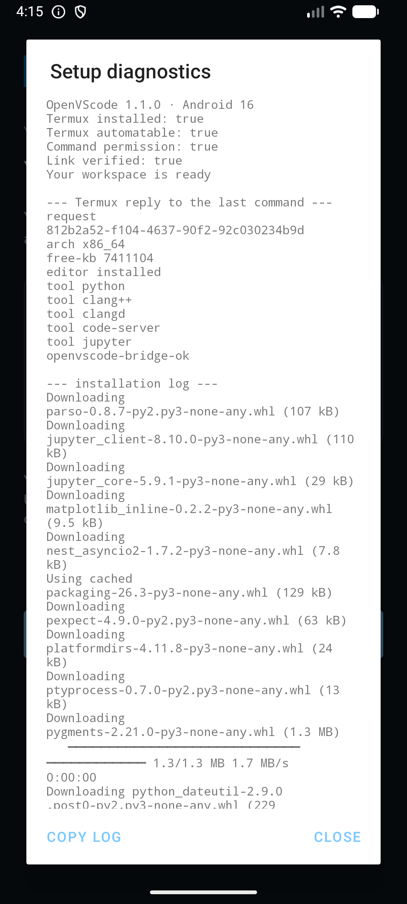
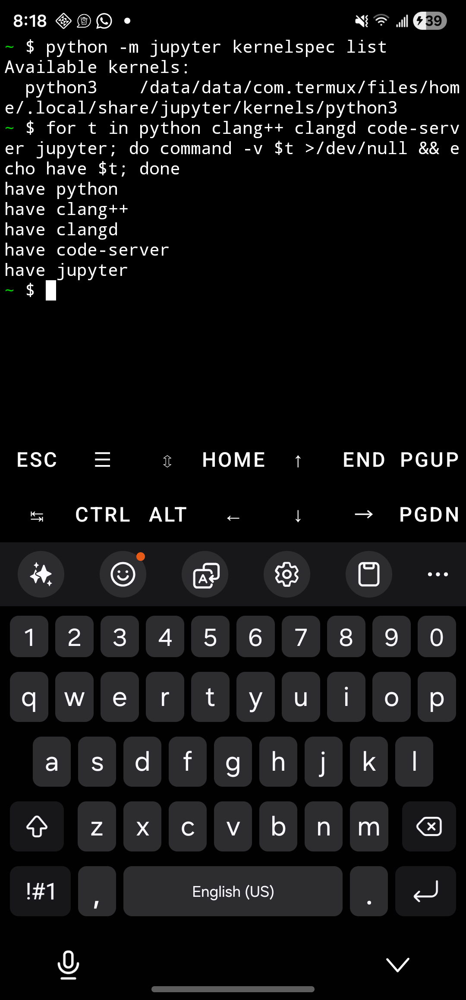
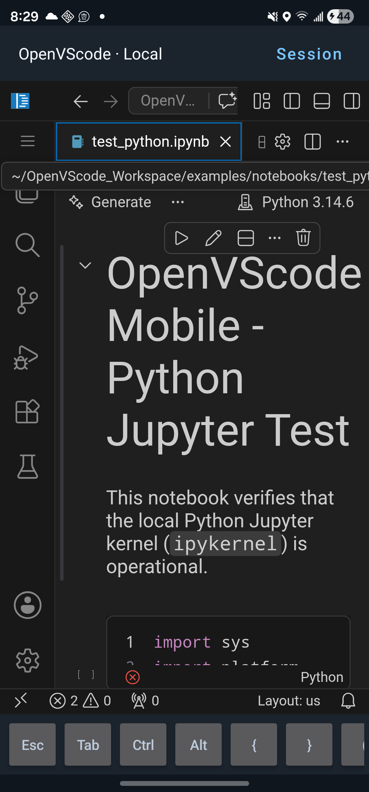

<p align="center">
  
</p>

<p align="center">
  <a href="https://github.com/hammadshakeelai/OpenVScode/releases/latest/download/OpenVScode-Mobile-apk.zip">
    
  </a>
</p>

<p align="center">
  <a href="https://github.com/hammadshakeelai/OpenVScode/actions/workflows/android.yml"></a>
  <a href="https://github.com/hammadshakeelai/OpenVScode/releases/latest"></a>
  
  
  
</p>

<p align="center">
  
  
  
  
  
</p>

---

## The app, screen by screen

The APK is the **shell**; Termux is the **engine**. You install Termux once, tap
through four steps, and the app installs code-server, Python and a C++ compiler
inside Termux, then opens the editor on `127.0.0.1:8080`.

<table>
<tr>
<td align="center" width="33%">
  <br>
  <b>1 · Welcome</b><br><sub>Four steps, stated up front.<br>No root, ~1 GB, 10–30 min.</sub>
</td>
<td align="center" width="33%">
  <br>
  <b>2 · Get Termux</b><br><sub>F-Droid or GitHub build.<br>The Play build cannot be driven.</sub>
</td>
<td align="center" width="33%">
  <br>
  <b>3 · Connect the apps</b><br><sub>One line to copy into Termux,<br>then a one-second link check.</sub>
</td>
</tr>
<tr>
<td align="center">
  <br>
  <b>4 · Live progress</b><br><sub>Real stages from the installer,<br>elapsed time, log always reachable.</sub>
</td>
<td align="center">
  <br>
  <b>5 · Ready</b><br><sub>Only shown once the editor<br>actually answers <code>/healthz</code>.</sub>
</td>
<td align="center">
  <br>
  <b>6 · The editor</b><br><sub>VS Code in a WebView, your<br>workspace, and the touch keybar.</sub>
</td>
</tr>
<tr>
<td align="center">
  <br>
  <b>Diagnostics</b><br><sub>The app asks Termux what it has,<br>instead of guessing.</sub>
</td>
<td align="center">
  <br>
  <b>Verified on arm64</b><br><sub>Galaxy S23 Ultra: every tool<br>present, kernel registered.</sub>
</td>
<td align="center">
  <br>
  <b>A real bug, caught on a phone</b><br><sub>Notebooks opened but no cell<br>could run. See the design review.</sub>
</td>
</tr>
</table>

> [!IMPORTANT]
> **Termux must be the F-Droid or GitHub build.** The Google Play build ships
> without the `RUN_COMMAND` service, so no app can drive it. The setup screen
> detects that build and tells you, instead of failing twenty minutes later.

---

## 📲 Install the APK (straight from your phone)

**On the phone, tap this link:**

### → [**Download OpenVScode-Mobile-apk.zip**](https://github.com/hammadshakeelai/OpenVScode/releases/latest/download/OpenVScode-Mobile-apk.zip) ←

That link always resolves to the newest build, so it never goes stale. Then:

1. Open **Files → Downloads** and tap the zip to extract it.
2. Tap `OpenVScode-Mobile.apk` inside.
3. Android will ask to allow installs from this source — tap **Settings**, turn on
   **Allow from this source**, go back, and tap **Install**.
4. Launch **OpenVScode** from your app drawer.

> [!TIP]
> **Why a zip and not the APK directly?** Chrome on Android routes `.apk` downloads
> through an APK-specific Safe Browsing check and holds the file until a verdict comes
> back. A debug-signed build from a small repo has no download reputation, so that
> verdict never resolves and the download **hangs at ~100% with no error** — the bytes
> have all arrived, Chrome just will not release the file. GitHub serves `.zip` as
> `application/octet-stream`, which skips that path. Same bytes either way; the
> checksums on each release prove it.

<details>
<summary><b>Other ways to get the APK</b></summary>

- **Direct APK:** [OpenVScode-Mobile.apk](https://github.com/hammadshakeelai/OpenVScode/releases/latest/download/OpenVScode-Mobile.apk)
  — identical build. Fine in Firefox, Samsung Internet, or on a desktop; this is the
  one that stalls in Chrome for Android.
- **Verify what you downloaded:** each release ships `SHA256SUMS.txt` covering both
  files. CI also fails the build if the zip does not extract to a byte-identical APK.
- **Browse every version:** the [Releases page](https://github.com/hammadshakeelai/OpenVScode/releases)
  lists each build with its notes.
- **Build it yourself:** `cd android && ./gradlew assembleDebug` — the APK lands in
  `android/app/build/outputs/apk/debug/`.

</details>

> [!NOTE]
> These are **debug** builds, signed with the standard Android debug key. That is what
> makes them installable without a Play Store account. Because `app/build.gradle` sets
> `applicationIdSuffix = ".debug"`, the package id is `com.openvscode.mobile.debug`, so
> it installs *alongside* a release build rather than replacing one.

### What the app does

A native Android shell around the IDE: a **foreground service** holding a wake lock so
Android will not kill your compiler mid-build, a hardware-accelerated **WebView** for the
editor, a **touch coding keybar** (`ESC`, `TAB`, `CTRL`, `ALT`, `{ }`, `( )`, arrows), and a
**bridge to Termux** that installs and starts everything for you.

It also watches the editor while you work: if code-server stops, the app notices within
seconds and offers to start it again, rather than leaving you inside a dialog that waits
forever for a process that is gone.

---

## ⚡ The same setup, by hand

> [!NOTE]
> **You do not need any of this if you use the app** — it stages these same scripts
> inside Termux and runs them for you, showing live progress. This section is the
> manual path: useful for a headless phone, for scripting, or for reading exactly
> what the app is about to do. Every step is idempotent, so a failed run can simply
> be repeated. Please [report what breaks](https://github.com/hammadshakeelai/OpenVScode/issues).

### Step 1 — Install Termux

Get **Termux** from [F-Droid](https://f-droid.org/en/packages/com.termux/) or the
[GitHub releases](https://github.com/termux/termux-app/releases). The Google Play
build is a separate, restricted app: it has no `RUN_COMMAND` service, so the OpenVScode
app cannot drive it.

### Step 2 — Paste one line

```bash
pkg install -y curl && curl -fsSL https://raw.githubusercontent.com/hammadshakeelai/OpenVScode/master/install.sh | bash
```

It installs `curl`, downloads the installer, and runs it, announcing each step:

| Step | What it does |
|---|---|
| **Checks Termux and your CPU** | Stops immediately with a clear message if you are not in Termux, instead of failing halfway through. |
| **Installs the toolchain** | Python 3, Clang, `make`, `cmake`, Git — then verifies Python imports SSL/SQLite and that a real C++ program compiles *and runs*. |
| **Installs the editor** | code-server from the Termux User Repository (pulls its own Node runtime). **10–30 minutes** on a phone connection. |
| **Prepares the workspace** | `~/OpenVScode_Workspace`, mobile editor defaults, example projects. |
| **Notebooks (opt-in)** | `psutil` from Termux packages, then `ipykernel`, `jupyter-server` and `notebook`; registers a kernel and checks it. |
| **Starts the IDE** | On `127.0.0.1:8080`, and waits until `/healthz` genuinely answers before saying it worked. |

Everything is written to `~/.local/state/openvscode/install.log`.

> [!TIP]
> **If it stops partway, run it again.** Every step checks whether it is already
> done, so re-running resumes rather than starting over. From the app, the same
> thing is one tap: **Help & diagnostics → Repair or update my workspace**.

### Step 3 — Open it

Either open the **OpenVScode** app — it finds `127.0.0.1:8080` on its own — or visit
`http://127.0.0.1:8080` in Chrome. To start it again later:

```bash
bash ~/.local/share/openvscode/runtime/start.sh
```

---

## 🚀 What you get

### 🐍 Python
Python 3 with pip, the `ms-python.python` extension, and a Run button for scripts.
Setup refuses to report success unless Python can import `ssl` and `sqlite3`.

### ⚡ C / C++
Clang with `make`, `cmake` and `pkg-config`, so `clang++` compiles C++20 out of the
box. Setup compiles and runs a real C++ program on your phone before declaring the
toolchain good.

> **Editor completion depends on your code-server build.** The clangd extension is
> installed when that build can host it; some builds answer that it is *not available
> for their platform*, which is permanent, and setup says so plainly instead of
> advising a retry that cannot work. Compiling and running are unaffected.

### 📓 Jupyter notebooks (opt-in, and still rough)
`ipykernel` plus `jupyter-server` and `notebook`, with a registered `python3` kernel.
Opt-in because it lengthens the download, and it can never turn a working editor into
a failed installation.

> [!WARNING]
> **Notebooks are the one part not yet working end to end.** On arm64 the Jupyter
> server did not install successfully, so notebooks open but cells may refuse to run.
> Setup now reports that honestly instead of claiming success. This is the first item
> in the [next version's plan](docs/DESIGN_REVIEW.md#6-redesign-proposal-for-the-next-version);
> Python, C++ and the editor are unaffected.

> **Why the server matters:** under code-server the Jupyter extension cannot use ZMQ
> kernels (the native module has no Android build), so it starts a Jupyter server
> instead. A kernel alone produced notebooks that opened and could not run a single
> cell — see [finding F10](docs/DESIGN_REVIEW.md#4-defects-that-only-a-device-found).

### 📱 Mobile ergonomics (and their limits)
Minimap and glyph margins off, word wrap on, auto-save on delay, the chat sidebar
hidden, workspace trust disabled so the extensions we install actually load — plus the
touch keybar. **This is not yet a phone-first interface**; it is desktop VS Code made
tolerable. The honest assessment and the plan are in the design review below.

---

## 🔬 Design review & next version

The interface is the weakest part of this release, and the next version is a redesign
rather than a patch. That work is documented as a research-style record, not a
changelog:

### → **[docs/DESIGN_REVIEW.md](docs/DESIGN_REVIEW.md)** ←

It contains the test method and devices, the measured install timings, **ten defects
that only appeared on real hardware** (with root causes), a measured critique of the
phone interface, and a prioritised redesign proposal for v1.2 — native navigation
instead of VS Code chrome, a real modifier keyboard, a first-class terminal pane,
progress that reflects reality, and session resilience.

---

## 📂 Repository structure

```
OpenVScode/
├── install.sh                       # Entry point: bundled (from the APK) or standalone
├── setup.sh                         # Toolchain → editor → workspace → extensions → notebooks
├── start.sh                         # Starts code-server, waits for /healthz, writes the pid
├── config/
│   ├── settings.json                # Mobile editor defaults (trust off, chat sidebar hidden)
│   ├── keybindings.json             # Mobile touch shortcuts
│   └── compile_flags.txt            # clangd include paths & C++20 standard
├── scripts/
│   ├── runtime.sh                   # Shared primitives: staging, locking, status, apt retries
│   ├── install_toolchain.sh         # Python, Clang, make, cmake + on-device verification
│   ├── install_extensions.sh        # Editor defaults + optional extensions (honest failures)
│   ├── install_jupyter_kernels.sh   # psutil via pkg, then ipykernel + jupyter-server
│   ├── status_server.py             # Authenticated, read-only progress on 127.0.0.1:8766
│   └── test_runtime.py              # 17 runtime tests (Linux/WSL)
├── examples/
│   ├── hello_python/                # Sample Python project
│   ├── hello_cpp/                   # Sample C++ project with Makefile
│   └── notebooks/                   # Sample Python & C++ notebooks
├── android/                         # Native Android app (Gradle project)
│   ├── app/src/main/java/com/openvscode/mobile/
│   │   ├── MainActivity.java        # Setup flow, editor WebView, keybar, watchdog
│   │   ├── TermuxBridge.java        # RUN_COMMAND dispatch, durable correlated state
│   │   ├── TermuxCommandBuilder.java# Builds the stdin script from APK assets only
│   │   ├── TermuxResultReceiver.java# Non-exported result receiver
│   │   ├── ServerAddress.java       # Address parsing / same-origin checks
│   │   └── VScodeService.java       # Foreground service + bounded wake lock
│   ├── scripts/smoke-test.ps1       # Device smoke test (install, launch, resume, logs)
│   ├── manifest.json                # PWA manifest for standalone browser mode
│   └── mobile-keyboard-bar.js       # Browser-side touch key bar
├── test-harness/                    # Browser simulator for the keybar
├── .github/workflows/android.yml    # CI: builds the APK, attaches it to releases
└── docs/
    ├── DESIGN_REVIEW.md             # Measurements, defects, interface critique, redesign
    ├── RUNTIME.md                   # The installer/app contract (ports, states, locking)
    ├── MOBILE_OPTIMIZATIONS.md      # RAM, battery, Android 12+ process fixes
    ├── JUPYTER_CPP_EXPLAINED.md     # C++ Jupyter kernels, in depth
    ├── SELF_BOOTSTRAP_PLAN.md       # The abandoned no-Termux path and why it failed
    └── assets/screens/              # The screenshots above
```

---

## 🛠️ Testing your installation

In `~/OpenVScode_Workspace`:

1. **Python** — open `examples/hello_python/main.py` and press **Run Python File**.
   It prints the interpreter version, platform and a list of squares.
2. **C++** — open `examples/hello_cpp/`, then in the integrated terminal run
   `make run`. It compiles with `clang++ -std=c++20 -Wall -Wextra -O2` and executes.
3. **Notebooks** — open `examples/notebooks/test_python.ipynb`, pick the
   **Python 3** kernel, and run the cells.
   `examples/notebooks/test_cpp.ipynb` needs a C++ kernel that setup does **not**
   install; [docs/JUPYTER_CPP_EXPLAINED.md](docs/JUPYTER_CPP_EXPLAINED.md) covers the options.

---

## 🔋 Recommended Android tweaks

1. **Battery** — set Termux (and OpenVScode) to *Unrestricted* in App settings.
2. **Android 12+ phantom process killer** — if long compiles die in the background, see
   [docs/MOBILE_OPTIMIZATIONS.md](docs/MOBILE_OPTIMIZATIONS.md).
3. **Keyboard** — a 5-row layout such as Hacker's Keyboard (F-Droid) helps until the
   keybar redesign lands.

---

## 🧑‍💻 Building locally

Requires JDK 17 and the Android SDK (compileSdk 35).

```bash
cd android
./gradlew assembleDebug
```

`local.properties` is deliberately untracked — Android Studio writes your own `sdk.dir`
into it on first open, or set `ANDROID_HOME` in your environment instead.

Every push to `master` runs the same build in CI, and pushing a `v*` tag publishes the
resulting APK to a GitHub Release.

---

## 📄 License

MIT. Built on open source: code-server / VS Code, LLVM/Clang, CPython, Project Jupyter,
Termux and Open VSX.
