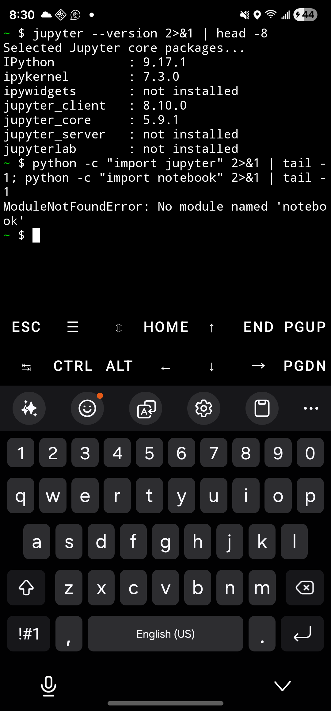

# A mobile IDE on Android via Termux orchestration

**Design review of OpenVScode 1.1.0 — measurements, defects, and a redesign proposal**

> **Status.** Version 1.1.0 is functionally complete and nothing in this document is
> being implemented right now. This is a reference for the next version: what was
> built, what was measured on real devices, where the interface fails a phone user,
> and what a redesign should change. Findings are reported as observed, including the
> ones that are still open.

---

## Abstract

A phone has the hardware of a 2015 laptop and none of its software. This project asks
whether a usable development environment — editor, Python, C++, notebooks — can be
installed on an unrooted Android phone by an app that guides the user, rather than by a
terminal recipe the user must understand.

The answer, as of 1.1.0, is **yes for the environment and no for the interface**. A
four-step guided setup installs code-server 4.137.0, Python 3.14.6 and Clang inside
Termux and opens the editor, verified end to end on both x86_64 (emulator) and arm64
(Samsung SM-S918U). Ten defects were found that no amount of local building revealed;
all but two are fixed. The editor itself, however, is desktop VS Code rendered in a
1080-pixel-wide WebView: functional, and not a phone-first tool. Section 5 measures why,
and section 6 proposes the redesign.

---

## 1. System under test

```
┌─────────────────────────────┐        RUN_COMMAND intent          ┌──────────────────────────┐
│  OpenVScode APK (5.47 MB)   │ ─────────────────────────────────▶ │  Termux (F-Droid build)  │
│                             │                                    │                          │
│  • setup flow + diagnostics │ ◀───────── PendingIntent result ── │  bash ← staged installer │
│  • WebView (the editor)     │                                    │  apt / pip / code-server │
│  • touch keybar             │ ◀── HTTP 8766 (authenticated) ──── │  status server (python)  │
│  • foreground service       │ ◀── HTTP 8080 /healthz ─────────── │  code-server 4.137.0     │
└─────────────────────────────┘                                    └──────────────────────────┘
```

**Why Termux at all.** An earlier architecture shipped a self-contained Linux image so
no second app was needed. It cannot work: a glibc or musl program launched by an Android
app is killed with `SIGSYS` (exit 159) by the app domain's seccomp policy — measured on
x86_64 *and* on arm64, which ruled out the "it might work on a real phone" hope
([`SELF_BOOTSTRAP_PLAN.md`](SELF_BOOTSTRAP_PLAN.md), [`../ARM64_TEST.md`](../ARM64_TEST.md)).
Termux's userland is bionic and has the platform's blessing, so it is the runtime, and
the app's job is orchestration. That decision deleted ~1.4 MB of dead code and the
entire image-build pipeline.

**Trust boundaries.** The app never executes downloaded binaries. It stages only assets
bundled in its own APK, passes them to `bash` over stdin, and reads progress from an
authenticated loopback endpoint. Command results are correlated by a per-operation UUID
so a late callback cannot complete a newer operation.

---

## 2. Method

| | Emulator | Phone |
|---|---|---|
| Device | `sdk_gphone64_x86_64` (AVD, 12 GB data) | Samsung **SM-S918U** (Galaxy S23 Ultra) |
| Android | 16 (API 36) | 16 (API 36) |
| ABI | x86_64 | **arm64-v8a** |
| Termux | 0.119.0-beta.3 (F-Droid build) | 0.119.0-beta.3 (F-Droid build) |
| Free space | 8.3 GB | 205 GB |

Instrumentation was deliberately outside the app: `adb` for install and input,
`uiautomator` dumps for the accessibility tree (which exposes the WebView's contents,
so VS Code's own controls are inspectable), screenshots for visual state, `adb forward`
plus `curl` for `GET /healthz` — which works regardless of which app is in the
foreground — and typed commands in Termux for ground truth about the environment.

**Evidence standard.** "Verified" means observed on a device. A green build, passing
unit tests, and a rendered screenshot were each true at moments when the device path was
broken, so none of them counted on their own. Where a claim is inferred rather than
observed, it says so.

---

## 3. Results: the environment works

Measured on the phone (arm64), one continuous run over Wi-Fi:

| Stage | Elapsed | Evidence |
|---|---|---|
| Link check (probe) | ~1 s | `openvscode-bridge-ok` returned with a matching request id |
| Toolchain verified | 1 m 45 s | "Checking that Python runs and C++ programs compile" |
| code-server installed (aarch64) | ~6 m | stage advanced past the TUR download |
| Extensions | 7 m | `ms-python.python` installed |
| Notebooks | 8 m | `psutil` from Termux packages, then `ipykernel` |
| Editor answering | **~10 m** | `/healthz` → `{"status":"alive"}` |

Ground truth afterwards, typed into Termux on the phone:

```
$ python -m jupyter kernelspec list
  python3    /data/data/com.termux/files/home/.local/share/jupyter/kernels/python3
$ for t in python clang++ clangd code-server jupyter; do command -v $t >/dev/null && echo have $t; done
have python · have clang++ · have clangd · have code-server · have jupyter
$ python -c "import ipykernel, psutil; print(ipykernel.__version__, psutil.__version__)"
7.3.0 7.2.2
```

Functional checks (emulator, driven through the editor and Termux):

- **Python** — `main.py` printed `Python 3.14.6`, `Android-16-x86_64-64bit`, and its
  computed output; the same file ran from the editor's integrated terminal.
- **C++** — `make run` executed `clang++ -std=c++20 -Wall -Wextra -O2 -o main main.cpp`
  then `./main`, printing `Sum of numbers : 55`.
- **App shell** — foreground service `isForeground=true` with
  `PARTIAL_WAKE_LOCK 'OpenVScode::SessionSupport' … LONG` held while editing; Session
  menu complete; keybar `{` reached Monaco through `InputConnection.commitText`.
- **Crash recovery** — `pkill -f code-server` while the editor was open: the app left
  the WebView within seconds, said *"The editor stopped in Termux"*, and one tap
  restored it (`/healthz` alive again).
- **Survives disconnection** — code-server kept serving across a USB detach/reattach.

---

## 4. Defects that only a device found

Each of these passed a clean build and unit tests. Nine were found by running the app on
a device; one (F10) required the *phone* specifically.

| # | Symptom | Root cause | Status |
|---|---|---|---|
| **F1** | Permission granted, then every install failed inexplicably | The **Google Play build of Termux** declares no `RUN_COMMAND` permission and ships no `RunCommandService`; Android silently refuses the request | Fixed — detected, with its own screen |
| **F2** | *"Termux could not finish"* while a healthy install was downloading | A second dispatch hit the installer's `flock` and exited **75**; the app treated that as failure | Fixed — adopts the running operation and follows its progress |
| **F3** | Notebooks reported installed when they were not, hiding the retry | Success was inferred from the operation exiting 0, but `setup.sh` treats a failed notebook step as a warning | Fixed — ground truth comes from the link check |
| **F4** | Notebook installs could never succeed, on any phone | `ipykernel` needs `psutil`, whose build script rejects Android: *"platform android is not supported"* | Fixed — Termux's packaged `python-psutil` first |
| **F5** | clangd extension "failed to download", advising a retry | code-server answers *"not available in code-server for the Web platform"* — permanent, not transient | Fixed — recognised, reported honestly, not retried |
| **F6** | Workspace opened in **Restricted Mode**, disabling the extensions just installed | Defaults were copied only when absent, so keys added later never reached an existing install | Fixed — additive merge that never overrides a user's value |
| **F7** | New examples and defaults could never reach an existing device | `setup.sh` copied `examples/` only if the directory was absent, and nothing re-ran setup once things looked installed | Fixed — per-project copy + **Repair or update my workspace** |
| **F8** | Killing the server left the user in code-server's *"Attempting to reconnect"* dialog forever | `checkRuntime()` and `render()` both return early while the editor is visible, so nothing polled; a WebSocket drop after load never reaches `onReceivedError` | Fixed — `/healthz` watchdog, three misses, then the app's own recovery |
| **F9** | The app asked to install notebooks it had already installed | `TermuxBridge` wrote `notebooks_installed` to its own `SharedPreferences` file; `MainActivity` read that key from a different file | Fixed — read through the bridge |
| **F10** | **Notebooks opened; no cell could run** | Under code-server the Jupyter extension cannot use ZMQ kernels (no Android build of the native module), so it requires a **Jupyter server**. The device had `jupyter_core` and `jupyter_client` but no `jupyter_server`, and no `notebook` module | **Open.** The installer now adds `jupyter-server` + `notebook` and refuses to claim success unless `import ipykernel, jupyter_server` works — but a manual `pip install jupyter-server notebook` on arm64 left `jupyter_server` still unimportable, and the failing dependency was not captured |


*F10 as the user meets it: the notebook renders, the kernel picker offers Python 3.14.6,
and the run attempt answers "Jupyter cannot be started."*

**The pattern worth keeping.** Six of these ten are the same mistake in different
clothes: **treating a proxy for success as success** — an exit code, a binary on `PATH`,
a preference written by someone else, a file that exists. The durable fix was to ask the
system the specific question ("is `jupyter_server` importable?", "did the marker print?",
"does `/healthz` answer?") and to let the answer be no.

---

## 5. Interface assessment

This is the part 1.1.0 does not solve. The setup flow is good; the editor is desktop
software on a phone screen.

### 5.1 What works and should survive a redesign

- **Four named steps, stated before they start**, with the cost up front ("~1 GB,
  10–30 minutes"). Users tolerate a long wait they were warned about.
- **Progress from the installer itself**, not a spinner: real stage text plus elapsed
  time, with the log one tap away.
- **Errors that name the next action** — "Complete the one-time setup line in Termux",
  "Start the editor again" — instead of a code.
- **Diagnostics that ask the engine** what it has rather than claiming what it installed.
- **Recovery paths in the UI**: Repair, Reconnect, link re-check, all reachable at any
  time from Help & diagnostics.

### 5.2 Measured problems with the editor surface

Observed on a 1080 × 2316 phone screen (S23 Ultra) and a 1080 × 2400 emulator:

1. **Chrome eats the screen.** Activity bar (~64 px) + primary sidebar (~370 px) + the
   secondary/chat sidebar (~360 px at default) consume well over half the width. Hiding
   the chat sidebar by default (now shipped) recovers a third of it; the layout is still
   built for a mouse and a 1440-pixel-wide window.
2. **The editor area is a minority of the screen.** With the tab bar, breadcrumbs, panel
   and status bar above our 52 dp keybar, code occupies roughly the middle half of the
   display.
3. **Touch targets are desktop-sized.** VS Code's icons are 22–28 px where Android's
   guidance is 48 dp (~132 px here). Tab close buttons, the kernel picker and cell
   toolbars are all near the limit of reliable tapping — several automated taps in this
   evaluation missed controls a finger would also miss.
4. **Two tabs fill the tab strip**, after which navigation means horizontal scrolling in
   a strip whose targets are already small.
5. **The soft keyboard and the integrated terminal fight.** Opening a terminal inside
   the WebView leaves a shell competing with the IME for a third of the screen.
6. **The keybar is one undifferentiated scrolling row.** Modifier state shows only as a
   colour change, arrows do not repeat on hold, and there is no discoverable route to
   the command palette or to `Ctrl+P`.
7. **Back is surprising.** In the editor, Android Back opens the app's Session dialog
   (by design, to avoid destroying the WebView) — but it is the same gesture users
   expect to dismiss a keyboard or close a tab.
8. **Notebook affordances are the worst case**: cell toolbars, the kernel selector and
   the run gutter are the smallest targets in the product, on the feature most likely to
   be used by a beginner.

### 5.3 Problems in the setup flow

- **Long silent stretches.** `apt` and `pip` can run for minutes inside one stage, so
  elapsed time moves while the stage text does not. There is no byte or package count.
- **No progress outside the app.** The foreground-service notification says a session is
  active but carries no installation progress, so leaving the app means losing sight of
  it.
- **The lock-collision path is reasoned, not proven.** `ov_lock` exits 75 and the app now
  follows the running operation, but every attempt to reproduce a collision on a device
  finished before the second dispatch landed. **Open.**
- **Notebook cell execution does not work yet.** F10's fix is committed, but on arm64 a
  manual `pip install jupyter-server notebook` finished without leaving `jupyter_server`
  importable — so notebooks remain unusable on that device and the installer's new check
  would correctly report the notebook step as failed. The pip error scrolled out of the
  capture, so the failing dependency is unknown; `jupyter_server` needs `argon2-cffi`,
  which needs `cffi`, and **neither has a Termux package** (both `python-cffi` and
  `python-argon2-cffi` are absent from termux-packages), so a source build is the likely
  casualty. **Open, and the first thing to investigate next.**

---

## 6. Redesign proposal for the next version

Ordered by expected benefit per unit of work. Each item names the finding it answers.

| # | Change | Why |
|---|---|---|
| **R1** | **Native navigation instead of VS Code chrome.** Put the file tree in an Android drawer, the command palette in a bottom sheet, and open files into a single full-width editor. Hide the activity bar and primary sidebar in the WebView. | §5.2 (1, 2, 4): recovers most of the screen and replaces the smallest targets with native ones |
| **R2** | **A real coding keyboard.** Latching modifiers with visible state, key repeat on hold, a second row for `Tab`/`Esc`/`/`/`:`/`-`/`_`, and swipe-for-arrows. | §5.2 (6) |
| **R3** | **Terminal as a first-class app pane**, driven through the existing Termux bridge rather than the WebView, so it composes with the IME instead of fighting it. | §5.2 (5) |
| **R4** | **Progress that reflects reality.** Parse `apt`/`pip` output for package counts and bytes; mirror stage and percentage into the foreground notification. | §5.3 |
| **R5** | **Session resilience.** Persist open editors and restore them; when Android kills Termux, offer a one-tap restart from the notification. | §5.3, F8 |
| **R6** | **Notebook-first path.** Validate the Jupyter server *before* offering notebooks, and consider a purpose-built cell runner for phones rather than VS Code's notebook UI. | F10, §5.2 (8) |
| **R7** | **Touch-target audit** of the app's own chrome against 48 dp, plus a TalkBack pass. | §5.2 (3) |
| **R8** | **Back-gesture rethink**: Back closes the keyboard, then the panel, then shows the Session sheet — matching Android expectations. | §5.2 (7) |
| **R9** | **Distribution**: a signed release build, F-Droid metadata, and an explicit in-app notice for the Play-build Termux case. | F1 |

**Non-goals.** Returning to a no-Termux rootfs (seccomp, §1), bundling a Node runtime in
the APK, and anything requiring root.

---

## 7. Limitations of this evaluation

- **One phone, one emulator, one network.** No low-RAM device, no Android 13/14, no
  metered connection. Install timings are from a single run each.
- **The operator was the author.** No user study; §5 is an expert critique with
  measurements, not evidence about real users.
- **Automation bias.** Driving the UI over `adb` found some bugs a human would have hit
  and missed others (for instance, it cannot judge whether a tap *felt* reliable).
- **Two findings remain open** (the lock-collision follow path and notebook cell
  execution), and they are marked as such rather than assumed good.
- **The Jupyter fix is unverified and probably incomplete.** The phone confirmed the
  *diagnosis* — `jupyter_server` missing, `notebook` absent — and then declined to be
  cured: pip did not deliver an importable `jupyter_server` on arm64. Installing the
  package list is evidently not sufficient on Android, so R6 should begin by capturing
  that pip failure rather than by trusting this fix.



*The evidence for F10 remaining open: `jupyter --version` on the phone lists
`jupyter_server: not installed`, and `import notebook` raises `ModuleNotFoundError`.*

---

## 8. Appendix: facts worth not rediscovering

| Fact | Value |
|---|---|
| APK | 5,739,436 bytes (5.47 MB), `versionCode 9`, `versionName 1.1.0` |
| Size history | 7.12 MB → 5.70 MB after deleting the rootfs architecture |
| `minSdk` / `targetSdk` | 26 / 35 |
| Editor | code-server **4.137.0** with Code 1.137.0, from the Termux User Repository |
| Runtime pulled by it | `nodejs-24` (24.18.0), plus `ripgrep`, `libsecret`, `brotli`, `c-ares` |
| Download size | ~218 MB of archives, ~929 MB installed |
| Python | 3.14.6 (Termux) |
| Notebook stack | `ipykernel 7.3.0`, `jupyter_client 8.10.0`, `jupyter_core 5.9.1`, `psutil 7.2.2` (Termux package) |
| Termux requirement | ≥ 0.109 for result callbacks; F-Droid/GitHub build only |
| Ports | editor `127.0.0.1:8080`, status `127.0.0.1:8766` (Bearer token) |
| State | `~/.local/state/openvscode/` (status.json, install.log, server.log, pids) |
| Staged runtime | `~/.local/share/openvscode/runtime/`, ~29 KB raw / ~39 KB base64, limit 120 KB |
| Lock | `flock` on fd 9; duplicate operation exits **75** |
| Tests | 26 JVM unit tests, 17 runtime tests (Linux/WSL), one device smoke test |
| Reproduce the smoke test | `android/scripts/smoke-test.ps1 -Serial emulator-5554` |
| `psutil` on Android | pip cannot build it; `pkg install python-psutil` (7.2.2) |
| clangd | binary ships with Termux's `clang`; the **extension** cannot be hosted by this code-server build |

### Image index

| File | Shows |
|---|---|
| `assets/screens/01-welcome.png` | First run: the four steps and the cost |
| `assets/screens/02-get-termux.png` | Termux step, F-Droid build required |
| `assets/screens/03-connect-apps.png` | The one-line Termux command and the link check |
| `assets/screens/04-installing.png` | Live installer stages with elapsed time (phone) |
| `assets/screens/05-ready.png` | Ready, shown only after `/healthz` answers |
| `assets/screens/06-editor.png` | The editor in the WebView with the keybar |
| `assets/screens/07-diagnostics.png` | Diagnostics reporting what Termux actually has |
| `assets/screens/08-notebook-blocked.png` | F10: notebook open, no cell can run |
| `assets/screens/09-arm64-toolchain.png` | arm64 ground truth: kernel and every tool present |
| `assets/screens/10-notebook-server-missing.png` | F10 open: `jupyter_server` not installed, `notebook` missing |
